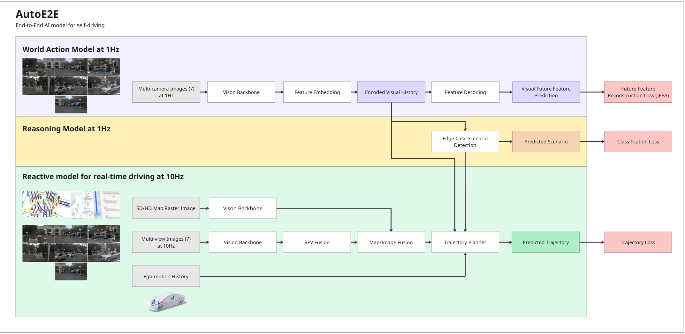

# AutoE2E Architecture

## Architecture Diagram
> **Note:** The architecture diagram is outdated and does not reflect the current implementation (separate map encoder branch, BEV fusion as default, residual map fusion). It will be updated in a follow-up PR.



## Inputs and Predictions
**AutoE2E consumes as input:**
- 7 camera images at 256x256 resolution (providing a surround view of the vehicle)
- Rendered map tile (indicating the high level road network layout and future route of the vehicle)
- Egomotion history (speed, acceleration, yaw angle and yaw angle rate for the previous 6.4s at 10Hz sampling rate)
- Visual history (`(896,)` = 64 frames × 14-dim compressed scene memory; provides frame-to-frame visual context, distinct from the planner GRU's intra-trajectory temporal coherence)

**AutoE2E outputs a prediction of:**
- Future driving trajectory (modelled as future acceleration and curvature values over a 6.4s future horizon at 10Hz sampling rate)
- `ego_hidden` — 256-dim final GRU hidden state from `TrajectoryPlanner` summarising the planner's intent over the prediction horizon. Conditions `FutureState`; replaces the legacy compressed visual feature vector / rolling visual history buffer.

**During training, and for purposes of model introspection, AutoE2E also predicts:**
- Future visual features at 1.6s intervals for a 6.4s future horizon (what does the future feature representation of the scene look like, this is used for a feature reconstruction loss similar to JEPA)

**Forward signature:**
```python
trajectory, ego_hidden, future_visual_features = model(
    visual_tiles,        # (B, V, 3, H, W) — 7 cameras
    map_tile,            # (B, 3, H_map, W_map) — BEV nav-map image
    visual_history,      # (B, 896) — frame-to-frame visual memory
    egomotion_history,   # (B, 256)
    camera_params=None,  # (B, V, 3, 4) optional, used by BEV fusion
    mode="train",        # "train" returns future_visual_features; otherwise None
)
```

**To learn the driving policy:**
- Imitation Learning is used to penalize trajectory prediction as well as World Model Simulation based Reinforcement Learning


